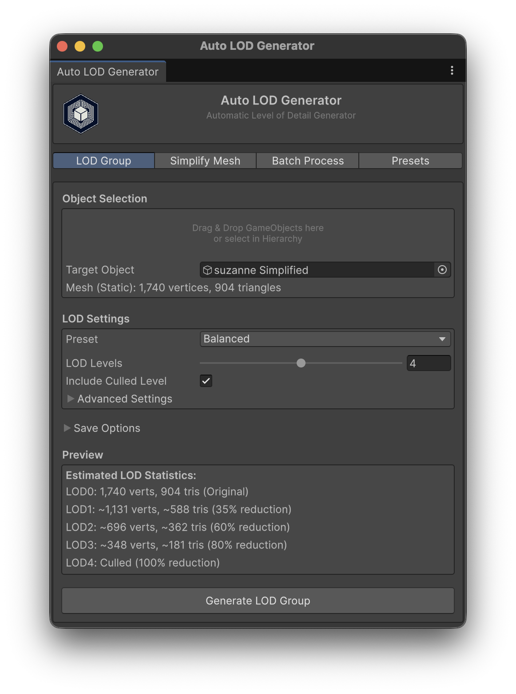

# Auto LOD Generator

[](https://unity.com/)
[](LICENSE)
[](https://github.com/manaporkun/Automatic-LOD-Generator/releases)
[](https://github.com/manaporkun/Automatic-LOD-Generator/actions/workflows/ci.yml)
[](Editor/Tests)

**Automatic Level of Detail (LOD) generator and mesh simplifier for Unity.**

Transform complex 3D meshes into optimized LOD groups with just a few clicks. Perfect for game developers who want to improve performance without manually creating multiple mesh versions.



---

## Table of Contents

- [Features](#features)
- [Why Use Auto LOD Generator?](#why-use-auto-lod-generator)
- [Installation](#installation)
- [Quick Start](#quick-start)
- [Presets](#presets)
- [Menu Reference](#menu-reference)
- [Advanced Features](#advanced-features)
- [API Usage](#api-usage)
- [Requirements](#requirements)
- [Troubleshooting](#troubleshooting)
- [FAQ](#faq)
- [Contributing](#contributing)
- [Changelog](#changelog)
- [License](#license)

---

## Features

### Core Features
- **One-Click LOD Generation** - Automatically create LOD groups with configurable quality levels
- **Batch Processing** - Process multiple objects at once for efficient workflow
- **6 Built-in Presets** - Pre-configured settings for different platforms and use cases
- **Customizable LOD Levels** - Configure 2-6 LOD levels with individual quality settings
- **Real-time Preview** - See estimated vertex/triangle counts before generation

### Mesh Support
- **Static Meshes** - Full support for MeshFilter + MeshRenderer objects
- **Skinned Meshes** - Full support for SkinnedMeshRenderer (animated characters)
- **Composite Models** - Supports imported prefab/model roots with mesh renderers on child objects
- **Save to Assets** - Export generated meshes as reusable .asset files

### Workflow
- **Drag & Drop Support** - Simply drag objects from hierarchy or project window
- **Context Menu Integration** - Right-click on objects for quick access
- **Keyboard Shortcuts** - Speed up your workflow with hotkeys (`Ctrl+Alt+L` / `Cmd+Alt+L`)
- **Undo Support** - Full integration with Unity's undo system
- **Custom Presets** - Save and load your own preset configurations

---

## Why Use Auto LOD Generator?

| Aspect | Without LOD | With Auto LOD |
|--------|-------------|---------------|
| **Draw Calls** | 1 high-poly mesh always rendered | 1 appropriate mesh based on distance |
| **Memory** | Full mesh in GPU memory | Smaller meshes at distance |
| **FPS Impact** | High on low-end devices | Optimized for all devices |
| **Setup Time** | Hours of manual work | Seconds with presets |

### Performance Example
A character with 10,000 triangles:
- **LOD0** (close): 10,000 triangles - 100% quality
- **LOD1** (medium): 6,500 triangles - 65% quality
- **LOD2** (far): 2,000 triangles - 20% quality
- **LOD3** (very far): Culled (0 triangles)

**Result**: Up to 80% reduction in GPU workload at distance.

---

## Installation

### Unity Package Manager (Recommended)

1. Open **Window > Package Manager**
2. Click **+ > Add package from git URL**
3. Enter:
   ```
   https://github.com/manaporkun/Automatic-LOD-Generator.git
   ```

The required [UnityMeshSimplifier](https://github.com/Whinarn/UnityMeshSimplifier/) dependency is installed automatically.

> **Note**: To install a specific version, append the tag to the URL:
> ```
> https://github.com/manaporkun/Automatic-LOD-Generator.git#v2.1.1
> ```

### Manual Installation

1. Download `Auto-LOD-Generator.unitypackage` from the [Releases page](https://github.com/manaporkun/Automatic-LOD-Generator/releases)
2. In Unity, go to **Assets > Import Package > Custom Package**
3. Select the downloaded file and import (the dependency will be installed automatically)

### Development Installation

For contributing or modifying the source:

1. Clone this repository
2. In Unity Package Manager, click **+ > Add package from disk**
3. Select the `package.json` at the repository root

---

## Quick Start

### Using the Main Window

1. Open **Tools > Auto LOD Generator > Open Window**
2. Select a GameObject with a mesh in your scene
3. Choose a preset or customize settings
4. Click **Generate LOD Group**

### Using Context Menu (Fastest)

1. Right-click on any mesh object in the Hierarchy
2. Select **Auto LOD > Generate LOD Group**

### Using Keyboard Shortcuts

| Shortcut | Action |
|----------|--------|
| `Ctrl+Alt+L` (Windows) / `Cmd+Alt+L` (Mac) | Quick Generate LOD Group |

---

## Presets

| Preset | LOD Levels | Best For |
|--------|------------|----------|
| **Performance** | 3 | Maximum FPS, aggressive simplification |
| **Balanced** | 4 | General use, good quality/performance balance (default) |
| **Quality** | 5 | Visual fidelity, gradual transitions |
| **Mobile (Low-end)** | 2 | Budget mobile devices |
| **Mobile (High-end)** | 3 | Modern mobile devices |
| **VR** | 4 | VR applications, avoids LOD popping |

### Quality Factor Guide

The quality factor determines how much the mesh is simplified:

| Quality | Triangle Reduction | Use Case |
|---------|-------------------|----------|
| 1.0 | 0% (original) | LOD0 - Always keep original |
| 0.75 | ~25% | LOD1 - Close distance |
| 0.5 | ~50% | LOD2 - Medium distance |
| 0.25 | ~75% | LOD3 - Far distance |
| 0.1 | ~90% | LOD4 - Very far distance |

### Mesh Simplification Options

Advanced options to control the mesh simplification algorithm:

| Option | Description | Recommended Use |
|--------|-------------|-----------------|
| **Enable Smart Link** | Links close vertices to prevent holes in simplified meshes | Always enabled (default) |
| **Vertex Link Distance** | Max distance for vertex linking | Increase for very large meshes |
| **Preserve Borders** | Preserves mesh edge boundaries | Architectural meshes, terrain |
| **Preserve UV Seams** | Prevents UV stretching at texture seams | Characters with seam-based UVs |
| **Preserve UV Foldovers** | Prevents distortion on overlapping UVs | Complex UV layouts |

**Preset Defaults:**
- **Performance**: Minimal preservation for maximum reduction
- **Quality/VR**: Borders and seams preserved for best visuals
- **Balanced**: Smart linking only

### Custom Presets

You can save your own custom presets:

1. Open the main window
2. Go to the **Presets** tab
3. Configure your settings
4. Enter a name and click **Save**

**Preset Storage Location**: Custom presets are saved to `Assets/Editor/AutoLODGenerator/Presets/` by default. This ensures they persist across package updates. You can change this location in the Presets tab.

---

## Menu Reference

### Tools Menu
| Menu Item | Description |
|-----------|-------------|
| `Tools > Auto LOD Generator > Open Window` | Main interface |
| `Tools > Auto LOD Generator > Quick Generate LOD Group` | Generate with Balanced preset |
| `Tools > Auto LOD Generator > Quick Simplify (50%)` | Create 50% simplified mesh |
| `Tools > Auto LOD Generator > Generate with Preset > ...` | Generate with specific preset |

### Context Menu (Right-click in Hierarchy)
| Menu Item | Description |
|-----------|-------------|
| `Auto LOD > Generate LOD Group` | Generate LOD group |
| `Auto LOD > Simplify Mesh (50%)` | Create 50% simplified version |
| `Auto LOD > Simplify Mesh (25%)` | Create 25% simplified version |
| `Auto LOD > Open Generator Window...` | Open main window |

---

## Advanced Features

### Save Meshes to Assets

Enable **Save Meshes to Assets** in the Save Options section to:
- Export generated LOD meshes as `.asset` files
- Reuse meshes across multiple prefabs
- Reduce scene file size
- **Default save location**: `Assets/GeneratedLODs/<ModelName>/`

### Skinned Mesh Support

The plugin automatically detects and handles both static and skinned meshes:

| Feature | Static Mesh | Skinned Mesh |
|---------|-------------|--------------|
| Component | MeshFilter + MeshRenderer | SkinnedMeshRenderer |
| Bone Preservation | N/A | ✅ Full support |
| Blend Shapes | N/A | ✅ Preserved |
| Animation | N/A | ✅ Works seamlessly |

### Custom LOD Settings

In the main window, expand **Advanced Settings** to customize:

- **Quality Factors** - Mesh quality for each LOD level (0.0 - 1.0)
- **Screen Transition Heights** - When each LOD level activates based on screen coverage (0.0 - 1.0)
- **Culled Level** - Optional level that completely hides the object at distance

### Batch Processing

1. Open the main window and go to the **Batch Process** tab
2. Drag multiple objects or click **Add from Selection**
3. Configure settings
4. Enable **Save Meshes to Assets** if needed
5. Click **Process X Objects**

---

## API Usage

For programmatic access, use the `LODGeneratorCore` class:

```csharp
using Plugins.AutoLODGenerator.Editor;

// Generate LOD group with default settings
var settings = new LODGeneratorSettings();
settings.ApplyPreset(LODPreset.Balanced);

var result = LODGeneratorCore.GenerateLODGroup(myGameObject, settings);

if (result.Success)
{
    Debug.Log($"Generated LOD group: {result.GeneratedLODGroup.name}");
    Debug.Log($"Original vertices: {result.OriginalVertexCount}");
}

// Generate with mesh saving
var resultWithSave = LODGeneratorCore.GenerateLODGroup(
    myGameObject,
    settings,
    saveMeshesToAssets: true,
    meshSavePath: "Assets/MyLODs");

// Simplify a single mesh
var simplifyResult = LODGeneratorCore.GenerateSimplifiedMesh(
    myGameObject,
    quality: 0.5f,
    saveMeshToAssets: true);

// Batch processing
var batchResult = LODGeneratorCore.ProcessBatch(
    gameObjectArray,
    settings,
    progressCallback: (progress, status) => Debug.Log($"{progress:P0} - {status}"),
    saveMeshesToAssets: true
);

// Save/Load custom presets
settings.SaveAsPreset("MyCustomPreset");
settings.LoadPreset("MyCustomPreset");

// Get available custom presets
string[] presets = LODGeneratorSettings.GetCustomPresetNames();

// Check mesh renderer type
var type = LODGeneratorCore.GetMeshRendererType(gameObject);
if (type == MeshRendererType.SkinnedMeshRenderer)
{
    Debug.Log("This is a skinned mesh!");
}
```

---

## Requirements

| Requirement | Version |
|-------------|---------|
| Unity | 2021.3 LTS or newer |
| UnityMeshSimplifier | Latest from [GitHub](https://github.com/Whinarn/UnityMeshSimplifier/) |
| Platform | Editor only (runtime not required) |

---

## Troubleshooting

### "Object does not have a valid mesh"
**Cause**: The selected object is missing required components.

**Solution**: Ensure the object has either:
- `MeshFilter` + `MeshRenderer` components, OR
- `SkinnedMeshRenderer` component

### LOD transitions are too aggressive/subtle
**Cause**: Default transition heights don't match your use case.

**Solution**: 
- Adjust Screen Transition Heights in Advanced Settings
- Try a different preset (Quality = gradual, Performance = aggressive)

### Simplified mesh looks bad
**Cause**: Some mesh topologies don't simplify well at low quality.

**Solution**:
- Increase the quality factor
- Try Quality preset instead of Performance
- Some meshes (with complex topology) may need manual LOD creation

### Skinned mesh animations break after LOD generation
**Cause**: Skeleton hierarchy or bone references were not preserved.

**Solution**:
- Ensure the original skeleton hierarchy is preserved
- Check that bone references are correctly assigned
- Verify the original `SkinnedMeshRenderer` has valid bone weights

---

## FAQ

**Q: Can I use this at runtime in my game?**

A: No, this is an Editor-only tool. The generated LOD groups work at runtime, but the generation process must happen in the Unity Editor.

**Q: Where are my custom presets saved?**

A: By default, presets are saved to `Assets/Editor/AutoLODGenerator/Presets/` in your project. This location survives package updates. You can change this in the Presets tab.

**Q: Will my old presets work after updating the package?**

A: Yes! The plugin automatically detects and migrates presets from the old location to the new location.

**Q: Does this work with procedural/mesh-animated objects?**

A: Yes, as long as the mesh has valid geometry. The simplified mesh will maintain the same structure as the original.

**Q: Can I edit the generated meshes?**

A: Yes, if you enable "Save Meshes to Assets", the meshes are saved as `.asset` files and can be modified like any other mesh asset.

**Q: What mesh formats are supported?**

A: Any mesh that Unity can import (FBX, OBJ, DAE, etc.) as long as it's a valid mesh with triangles. Imported prefab roots are supported when their child objects contain valid MeshRenderer or SkinnedMeshRenderer components, which covers common GLB/glTF and USDZ workflows after an appropriate Unity importer has converted the file into GameObjects.

---

## Contributing

Contributions are welcome! Please read our [Contributing Guidelines](CONTRIBUTING.md) before submitting issues or pull requests.

### Development Setup
1. Clone this repository
2. Create a new Unity 2021.3+ project (or use an existing one)
3. In Package Manager, click **+ > Add package from disk** and select the `package.json` at the repo root
4. Install the [UnityMeshSimplifier](https://github.com/Whinarn/UnityMeshSimplifier/) dependency
5. Import the demo scene from **Package Manager > Auto LOD Generator > Samples**
6. Make your changes and submit a pull request

---

## Changelog

See [CHANGELOG.md](CHANGELOG.md) for version history and release notes.

---

## License

This project is licensed under the GNU General Public License v3.0 - see the [LICENSE](LICENSE) file for details.

---

## Credits

- Built on [UnityMeshSimplifier](https://github.com/Whinarn/UnityMeshSimplifier/) by Mattias Edlund
